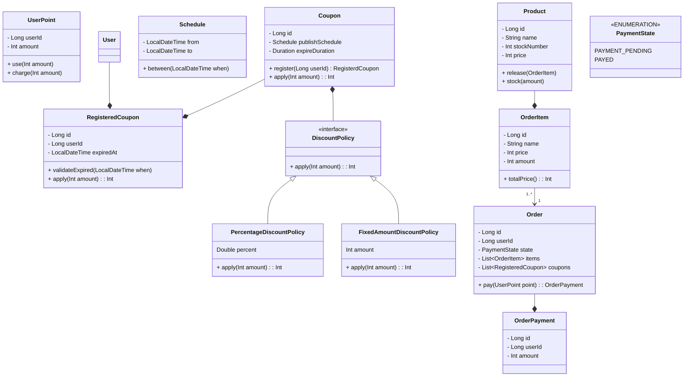

## 규칙
1. 상품 재고는 이벤트기반으로 관리하고 도메인 클래스만을 기재합니다.
2. 도메인 클래스 생성시에 필요하긴하지만 도메인로직에서 사용되지 않는 디비엔티티의 상태는 기재하지 않습니다.

```mermaid
classDiagram
    class UserPoint {
        - Long userId
        - Int amount
        + use(Int amount)
        + charge(Int amount)
    }
    
    class RegisteredCoupon {
        - Long id
        - Long userId
        - LocalDateTime expiredAt
        + validateExpired(LocalDateTime when)
        + apply(Int amount): Int
    }
    
    
    class Coupon {
        - Long id
        - Schedule publishSchedule
        - Duration expireDuration
        + register(Long userId) RegisterdCoupon
        + apply(Int amount) : Int
    }
    
    Coupon *-- DiscountPolicy
    
    class DiscountPolicy {
        <<interface>>
        + apply(Int amount) : Int
    }
    
    class PercentageDiscountPolicy {
        Double percent
        + apply(Int amount) : Int
    }
    class FixedAmountDiscountPolicy {
        Int amount
        + apply(Int amount) : Int
    }
    DiscountPolicy <|-- PercentageDiscountPolicy
    DiscountPolicy <|-- FixedAmountDiscountPolicy
    
    class Schedule {
        - LocalDateTime from
        - LocalDateTime to
        + between(LocalDateTime when)
    }
    
    
    User --* RegisteredCoupon
    Coupon --* RegisteredCoupon
    
    class Product {
        - Long id
        - String name
        - Int stockNumber
        - Int price
        + release(OrderItem)
        + stock(amount)
    }
    
    class OrderItem {
        - Long id
        - String name
        - Int price
        - Int amount
        + totalPrice(): Int
    }
    
    class PaymentState {
        <<ENUMERATION>>
        PAYMENT_PENDING
        PAYED
    }
    
    class Order {
        - Long id
        - Long userId
        - PaymentState state
        - List~OrderItem~ items
        - List~RegisteredCoupon~ coupons
        + pay(UserPoint point): OrderPayment
    }
    
    class OrderPayment {
        - Long id
        - Long userId
        - Int amount
    }
    Order --* OrderPayment
    OrderItem "1..*" --> "1" Order
    Product --* OrderItem
```