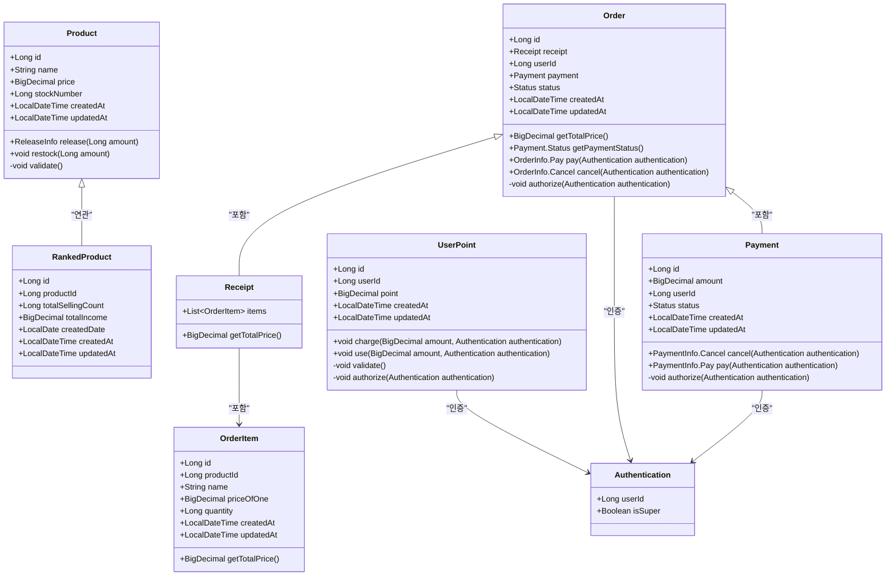

```mermaid
classDiagram
    class Product {
        +Long id
        +String name
        +BigDecimal price
        +Long stockNumber
        +LocalDateTime createdAt
        +LocalDateTime updatedAt
        +ReleaseInfo release(Long amount)
        +void restock(Long amount)
        -void validate()
    }

    class RankedProduct {
        +Long id
        +Long productId
        +Long totalSellingCount
        +BigDecimal totalIncome
        +LocalDate createdDate
        +LocalDateTime createdAt
        +LocalDateTime updatedAt
    }
    class UserPoint {
        +Long id
        +Long userId
        +BigDecimal point
        +LocalDateTime createdAt
        +LocalDateTime updatedAt
        +void charge(BigDecimal amount, Authentication authentication)
        +void use(BigDecimal amount, Authentication authentication)
        -void validate()
        -void authorize(Authentication authentication)
    }
    class Order {
        +Long id
        +Receipt receipt
        +Long userId
        +Payment payment
        +Status status
        +LocalDateTime createdAt
        +LocalDateTime updatedAt
        +BigDecimal getTotalPrice()
        +Payment.Status getPaymentStatus()
        +OrderInfo.Pay pay(Authentication authentication)
        +OrderInfo.Cancel cancel(Authentication authentication)
        -void authorize(Authentication authentication)
    }
    class OrderItem {
        +Long id
        +Long productId
        +String name
        +BigDecimal priceOfOne
        +Long quantity
        +LocalDateTime createdAt
        +LocalDateTime updatedAt
        +BigDecimal getTotalPrice()
    }
    class Receipt {
        +List~OrderItem~ items
        +BigDecimal getTotalPrice()
    }
    class Payment {
        +Long id
        +BigDecimal amount
        +Long userId
        +Status status
        +LocalDateTime createdAt
        +LocalDateTime updatedAt
        +PaymentInfo.Cancel cancel(Authentication authentication)
        +PaymentInfo.Pay pay(Authentication authentication)
        -void authorize(Authentication authentication)
    }
    class Authentication {
        +Long userId
        +Boolean isSuper
    }

    Product <|-- RankedProduct: "연관"
    Order <|-- Receipt: "포함"
    Order <|-- Payment: "포함"
    Receipt --> OrderItem: "포함"
    UserPoint --> Authentication: "인증"
    Order --> Authentication: "인증"
    Payment --> Authentication: "인증"
```