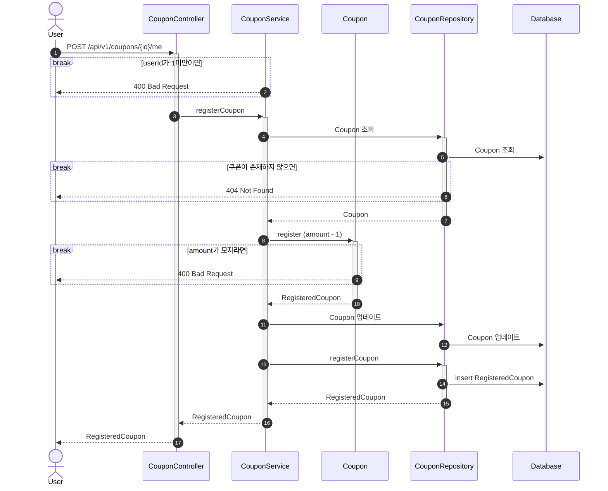
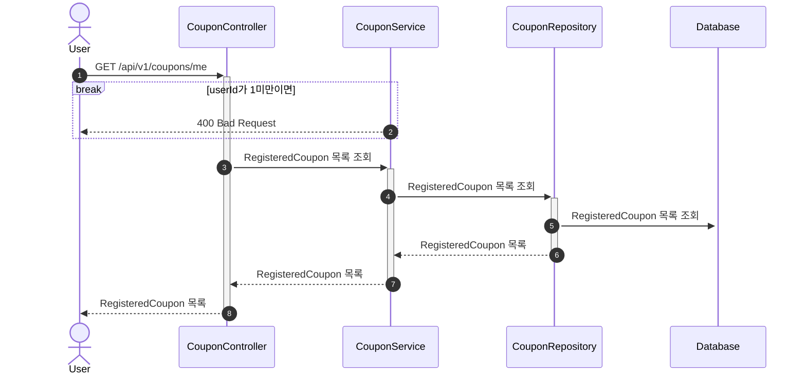

## 선착순 쿠폰 발급 API

```mermaid
sequenceDiagram
    autonumber
    actor User
    participant CouponController
    participant CouponService
    participant Coupon
    participant CouponRepository
    participant Database
    User ->>+ CouponController: POST /api/v1/coupons/{id}/me
    break userId가 1미만이면
        CouponService -->> User: 400 Bad Request
    end
    CouponController ->>+ CouponService: registerCoupon
    CouponService ->>+ CouponRepository: Coupon 조회
    CouponRepository ->>+ Database: Coupon 조회
    break 쿠폰이 존재하지 않으면
        CouponRepository -->> User: 404 Not Found
    end
    CouponRepository -->>- CouponService: Coupon
    CouponService ->>+ Coupon: register (amount - 1)
    break amount가 모자라면
        Coupon -->> User: 400 Bad Request
    end
    Coupon -->>- CouponService: RegisteredCoupon
    CouponService ->> CouponRepository: Coupon 업데이트
    CouponRepository ->> Database: Coupon 업데이트
    CouponService ->>+ CouponRepository: registerCoupon
    CouponRepository ->> Database: insert RegisteredCoupon
    CouponRepository -->>- CouponService: RegisteredCoupon
    CouponService -->>- CouponController: RegisteredCoupon
    CouponController -->>- User: RegisteredCoupon
```

## 보유 쿠폰 조회 API

```mermaid
sequenceDiagram
    autonumber
    actor User
    participant CouponController
    participant CouponService
    participant CouponRepository
    participant Database
    User ->>+ CouponController: GET /api/v1/coupons/me
    break userId가 1미만이면
        CouponService -->> User: 400 Bad Request
    end
    CouponController ->>+ CouponService: RegisteredCoupon 목록 조회
    CouponService ->>+ CouponRepository: RegisteredCoupon 목록 조회
    CouponRepository ->>+ Database: RegisteredCoupon 목록 조회
    CouponRepository -->>- CouponService: RegisteredCoupon 목록
    CouponService -->>- CouponController: RegisteredCoupon 목록
    CouponController -->>- User: RegisteredCoupon 목록
```

