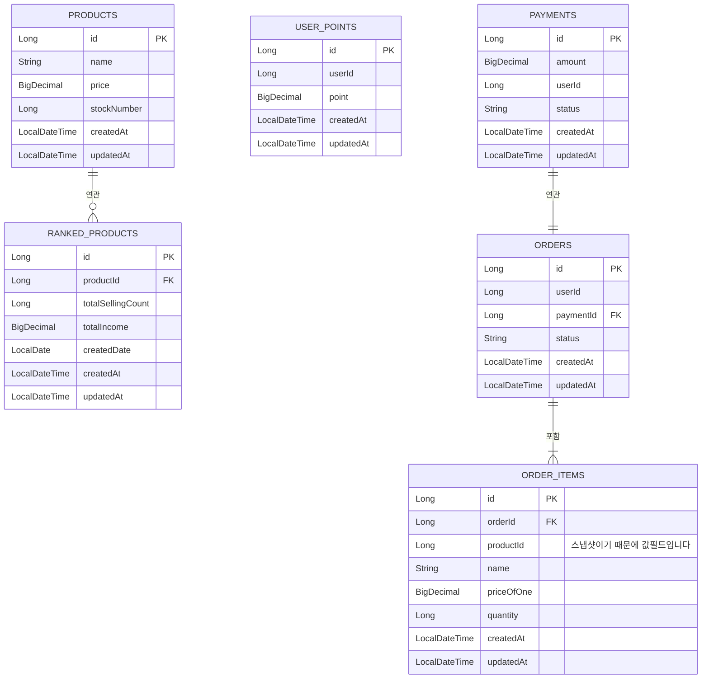

## ERD

userId는 외부에서 공급받습니다.

```mermaid
erDiagram
    PRODUCTS {
        Long id PK
        String name
        BigDecimal price
        Long stockNumber
        LocalDateTime createdAt
        LocalDateTime updatedAt
    }
    RANKED_PRODUCTS {
        Long id PK
        Long productId FK
        Long totalSellingCount
        BigDecimal totalIncome
        LocalDate createdDate
        LocalDateTime createdAt
        LocalDateTime updatedAt
    }
    USER_POINTS {
        Long id PK
        Long userId
        BigDecimal point
        LocalDateTime createdAt
        LocalDateTime updatedAt
    }
    ORDERS {
        Long id PK
        Long userId
        Long paymentId FK
        String status
        LocalDateTime createdAt
        LocalDateTime updatedAt
    }
    ORDER_ITEMS {
        Long id PK
        Long orderId FK
        Long productId "스냅샷이기 때문에 값필드입니다"
        String name
        BigDecimal priceOfOne
        Long quantity
        LocalDateTime createdAt
        LocalDateTime updatedAt
    }
    PAYMENTS {
        Long id PK
        BigDecimal amount
        Long userId
        String status
        LocalDateTime createdAt
        LocalDateTime updatedAt
    }

    PRODUCTS ||--o{ RANKED_PRODUCTS: "연관"
    ORDERS ||--|{ ORDER_ITEMS: "포함"
    PAYMENTS ||--|| ORDERS: "연관"
```