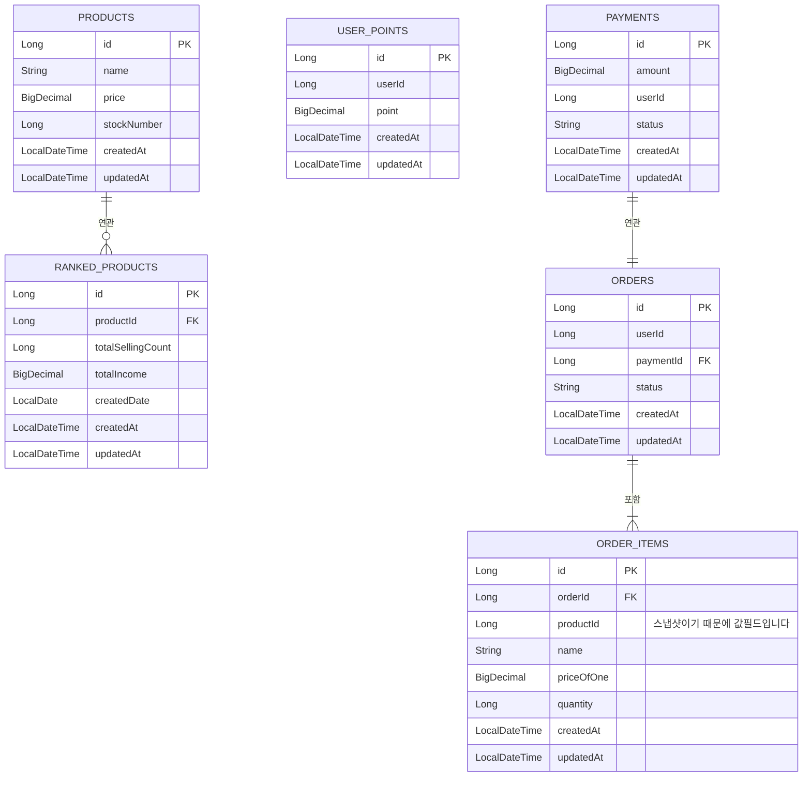
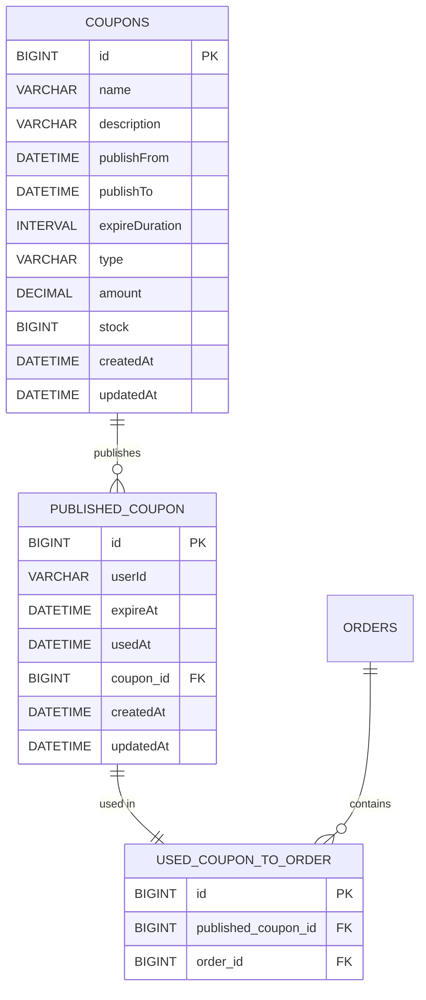

## ERD

userId는 외부에서 공급받습니다.

# 쿠폰을 제외한 도메인

```mermaid
erDiagram
    PRODUCTS {
        Long id PK
        String name
        BigDecimal price
        Long stockNumber
        LocalDateTime createdAt
        LocalDateTime updatedAt
    }
    RANKED_PRODUCTS {
        Long id PK
        Long productId FK
        Long totalSellingCount
        BigDecimal totalIncome
        LocalDate createdDate
        LocalDateTime createdAt
        LocalDateTime updatedAt
    }
    USER_POINTS {
        Long id PK
        Long userId
        BigDecimal point
        LocalDateTime createdAt
        LocalDateTime updatedAt
    }
    ORDERS {
        Long id PK
        Long userId
        Long paymentId FK
        String status
        LocalDateTime createdAt
        LocalDateTime updatedAt
    }
    ORDER_ITEMS {
        Long id PK
        Long orderId FK
        Long productId "스냅샷이기 때문에 값필드입니다"
        String name
        BigDecimal priceOfOne
        Long quantity
        LocalDateTime createdAt
        LocalDateTime updatedAt
    }
    PAYMENTS {
        Long id PK
        BigDecimal amount
        Long userId
        String status
        LocalDateTime createdAt
        LocalDateTime updatedAt
    }

    PRODUCTS ||--o{ RANKED_PRODUCTS: "연관"
    ORDERS ||--|{ ORDER_ITEMS: "포함"
    PAYMENTS ||--|| ORDERS: "연관"
```

# 쿠폰 도메인

```mermaid
erDiagram
    COUPONS {
        BIGINT id PK
        VARCHAR name
        VARCHAR description
        DATETIME publishFrom
        DATETIME publishTo
        INTERVAL expireDuration
        VARCHAR type
        DECIMAL amount
        BIGINT stock
        DATETIME createdAt
        DATETIME updatedAt
    }

    PUBLISHED_COUPON {
        BIGINT id PK
        VARCHAR userId
        DATETIME expireAt
        DATETIME usedAt
        BIGINT coupon_id FK
        DATETIME createdAt
        DATETIME updatedAt
    }

    USED_COUPON_TO_ORDER {
        BIGINT id PK
        BIGINT published_coupon_id FK
        BIGINT order_id FK
    }

    ORDERS {
    %% 기타 Order에 해당하는 필드들 (생략)
    }

%% 관계 정의
    COUPONS ||--o{ PUBLISHED_COUPON: "publishes"
    PUBLISHED_COUPON ||--|| USED_COUPON_TO_ORDER: "used in"
    ORDERS ||--o{ USED_COUPON_TO_ORDER: "contains"
```