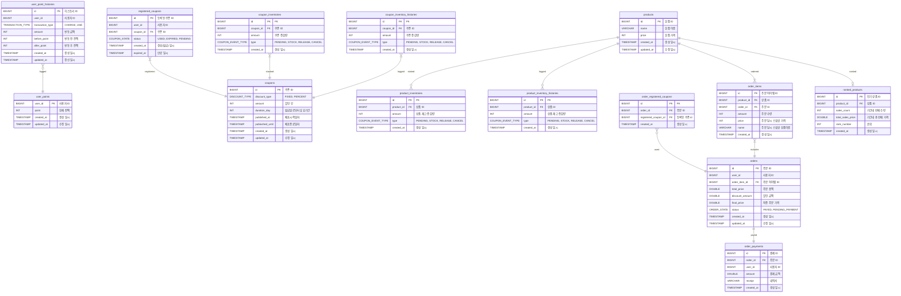

## ERD

관계만 표시합니다.

```mermaid
    erDiagram
    user_points {
        BIGINT user_id PK "사용자 ID"
        INT point "현재 잔액"
        TIMESTAMP created_at "생성 일시"
        TIMESTAMP updated_at "수정 일시"
    }
    user_point_histories {
        BIGINT id PK "히스토리 ID"
        BIGINT user_id "사용자 ID"
        TRANSACTION_TYPE transaction_type "CHARGE, USE"
        INT amount "변동 금액"
        INT before_point "변동 전 잔액"
        INT after_point "변동 후 잔액"
        TIMESTAMP created_at "생성 일시"
        TIMESTAMP updated_at "갱신 일시"
    }
    coupons {
        BIGINT id PK "쿠폰 ID"
        DISCOUNT_TYPE discount_type "FIXED, PERCENT"
        INT amount "할인 양"
        INT duration_day "발급일로부터 유효기간"
        TIMESTAMP published_at "배포시작일자"
        TIMESTAMP publushed_until "배포종료일자"
        TIMESTAMP created_at "생성 일시"
        TIMESTAMP updated_at "수정 일시"
    }
    registered_coupons {
        BIGINT id PK "등록된 쿠폰 ID"
        BIGINT user_id "사용자 ID"
        BIGINT coupon_id FK "쿠폰 ID"
        COUPON_STATE status "USED, EXPIRED, PENDING"
        TIMESTAMP created_at "생성(발급) 일시"
        TIMESTAMP expired_at "만료 일시"
    }
    coupon_inventories {
        BIGINT id PK "PK"
        BIGINT coupon_id FK "쿠폰 ID"
        INT amount "쿠폰 증감량"
        COUPON_EVENT_TYPE type "PENDING, STOCK, RELEASE, CANCEL"
        TIMESTAMP created_at "생성 일시"
    }
    coupon_inventory_histories {
        BIGINT id PK "PK"
        BIGINT coupon_id FK "쿠폰 ID"
        INT amount "쿠폰 증감량"
        COUPON_EVENT_TYPE type "PENDING, STOCK, RELEASE, CANCEL"
        TIMESTAMP created_at "생성 일시"
    }
    products {
        BIGINT id PK "상품 ID"
        VARCHAR name "상품 이름"
        INT price "상품 가격"
        TIMESTAMP created_at "생성 일시"
        TIMESTAMP updated_at "수정 일시"
    }
    product_inventories {
        BIGINT id PK "PK"
        BIGINT product_id FK "상품 ID"
        INT amount "상품 재고 증감량"
        COUPON_EVENT_TYPE type "PENDING, STOCK, RELEASE, CANCEL"
        TIMESTAMP created_at "생성 일시"
    }
    product_inventory_histories {
        BIGINT id PK "PK"
        BIGINT product_id FK "상품 ID"
        INT amount "상품 재고 증감량"
        COUPON_EVENT_TYPE type "PENDING, STOCK, RELEASE, CANCEL"
        TIMESTAMP created_at "생성 일시"
    }
    order_items {
        BIGINT id PK "주문 아이템 ID"
        BIGINT product_id FK "상품 ID"
        BIGINT order_id FK "주문 ID"
        INT amount "주문 수량"
        INT price "주문 당시 스냅샷 가격"
        VARCHAR name "주문 당시 스냅샷 상품이름"
        TIMESTAMP created_at "생성 일시"
    }
    orders {
        BIGINT id PK "주문 ID"
        BIGINT user_id "사용자 ID"
        BIGINT order_item_id FK "주문 아이템 ID"
        DOUBLE total_price "주문 총액"
        DOUBLE discount_amount "할인 금액"
        DOUBLE final_price "최종 주문 가격"
        ORDER_STATE status "PAYED, PENDING_PAYMENT"
        TIMESTAMP created_at "생성 일시"
        TIMESTAMP updated_at "수정 일시"
    }
    order_registered_coupons {
        BIGINT id PK "PK"
        BIGINT order_id FK "주문 ID"
        BIGINT registered_coupon_id FK "등록된 쿠폰 id"
        TIMESTAMP created_at "생성 일시"
    }
    order_registered_coupons }o--|| orders: used
    order_payments {
        BIGINT id PK "결제 ID"
        BIGINT order_id FK "주문 ID"
        BIGINT user_id "사용자 ID"
        DOUBLE amount "결제 금액"
        VARCHAR receipt "내역서"
        TIMESTAMP created_at "생성 일시"
    }
    ranked_products {
        BIGINT id PK "인기 상품 ID"
        BIGINT product_id FK "상품 ID"
        INT sales_count "기간내 판매 수량"
        DOUBLE total_sales_price "기간내 총 판매 가격"
        INT rank_number "순위"
        TIMESTAMP created_at "생성 일시"
    }
    user_point_histories }o--|| user_points: logged
    registered_coupons }|--|| coupons: registered
    coupon_inventories }|--|| coupons: stocked
    coupon_inventory_histories }|--|| coupons: logged
    products ||--|{ order_items: ordered
    products ||--o{ product_inventories: stoked
    products ||--o{ product_inventory_histories: logged
    products ||--o| ranked_products: ranked
    order_items }|--|| orders: includes
    orders ||--|| order_payments: payed
```