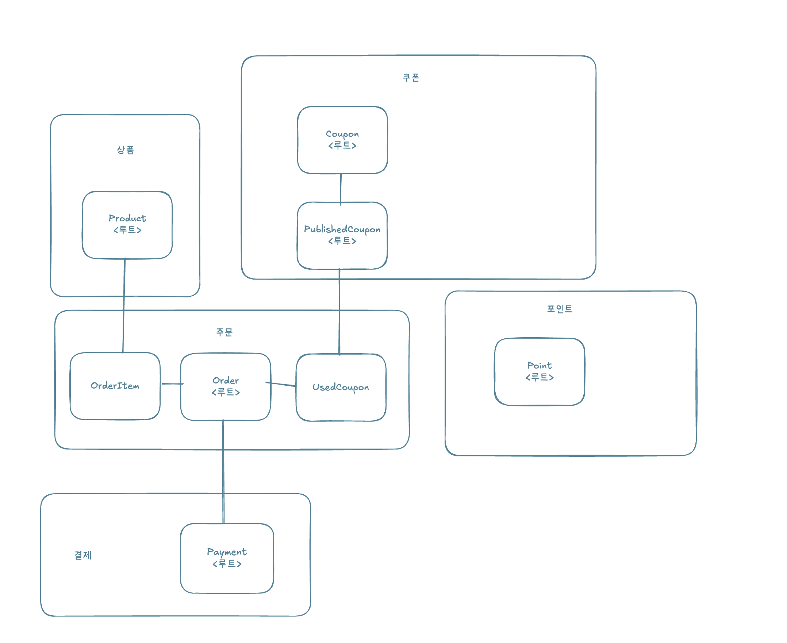
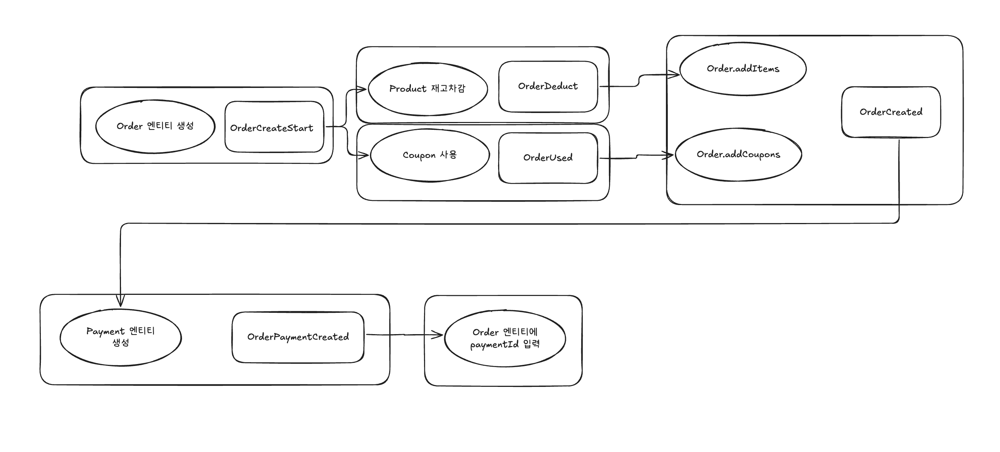
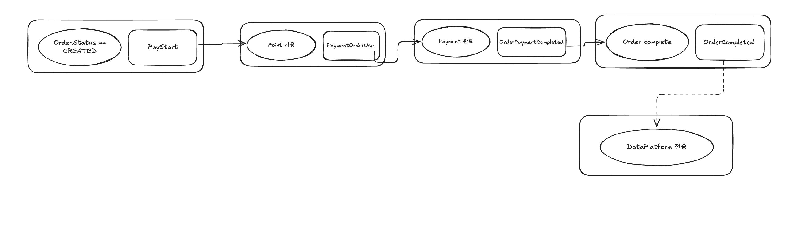

# 이벤트 드리븐

## 이벤트 설계 (분산 트랜잭션 적용 전)

실선: BEFORE_COMMIT  
점선: AFTER_COMMIT+Async

### 주문 생성

갈라진 이벤트를 검증하기 위해  
Order에 productStatus, couponStatus 추가  
TODO: 추후 OrderProcess.CreateStart 처럼 만들고 레디스 활용하여 관리

### 주문 결제

