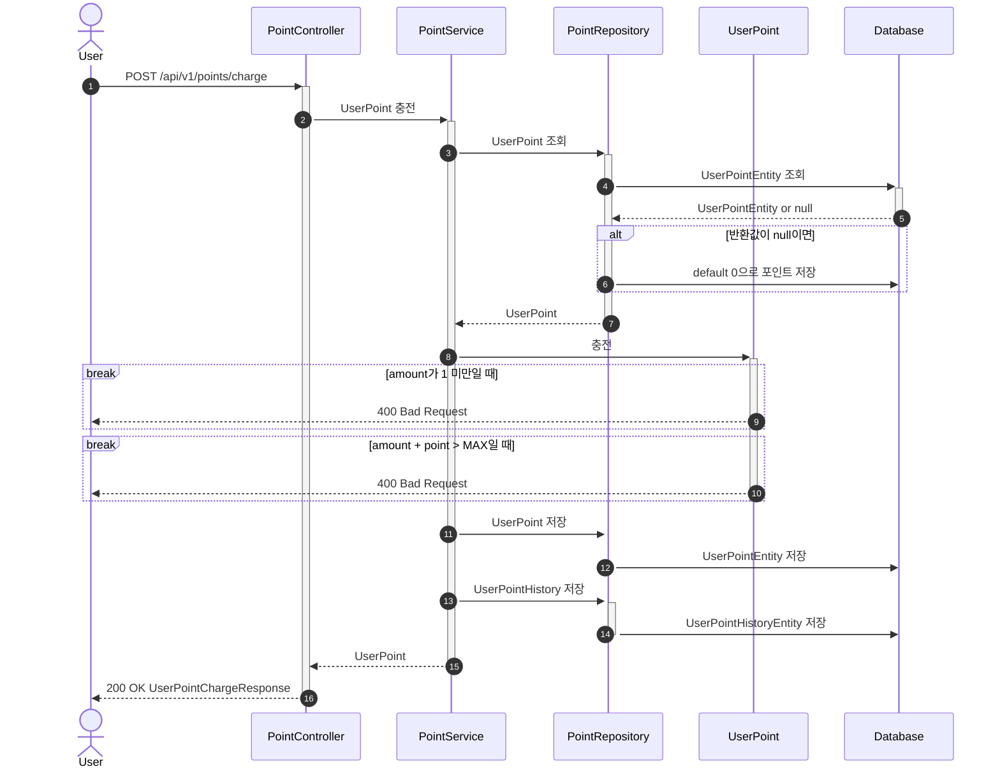
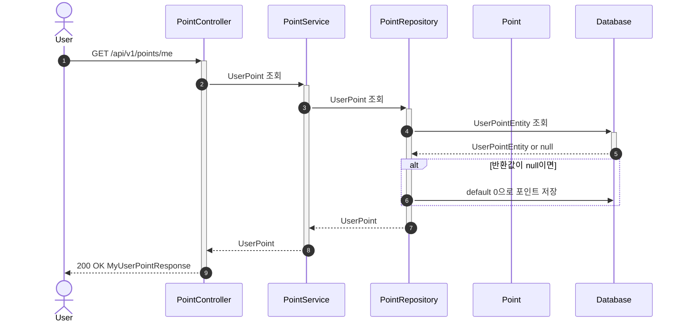

## 잔액 충전 API

```mermaid
sequenceDiagram
    autonumber
    actor User
    participant PointController
    participant PointService
    participant PointRepository
    participant UserPoint
    participant Database
    User ->>+ PointController: POST /api/v1/points/charge
    PointController ->>+ PointService: UserPoint 충전
    PointService ->>+ PointRepository: UserPoint 조회
    PointRepository ->>+ Database: UserPointEntity 조회
    Database -->>- PointRepository: UserPointEntity or null
    alt 반환값이 null이면
        PointRepository ->> Database: default 0으로 포인트 저장
    end
    PointRepository -->>- PointService: UserPoint
    PointService ->>+ UserPoint: 충전
    break amount가 1 미만일 때
        UserPoint -->> User: 400 Bad Request
    end
    break amount + point > MAX일 때
        UserPoint -->> User: 400 Bad Request
    end
    deactivate UserPoint
    PointService ->>+ PointRepository: UserPoint 저장
    PointRepository ->> Database: UserPointEntity 저장
    PointService ->>+ PointRepository: UserPointHistory 저장
    PointRepository ->> Database: UserPointHistoryEntity 저장
    deactivate PointRepository
    PointService -->>- PointController: UserPoint
    PointController -->>- User: 200 OK UserPointChargeResponse
```

## 잔액 조회 API

```mermaid
sequenceDiagram
    autonumber
    actor User
    participant PointController
    participant PointService
    participant PointRepository
    participant Point
    participant Database
    User ->>+ PointController: GET /api/v1/points/me
    PointController ->>+ PointService: UserPoint 조회
    PointService ->>+ PointRepository: UserPoint 조회
    PointRepository ->>+ Database: UserPointEntity 조회
    Database -->>- PointRepository: UserPointEntity or null
    alt 반환값이 null이면
        PointRepository ->> Database: default 0으로 포인트 저장
    end
    PointRepository -->>- PointService: UserPoint
    PointService -->>- PointController: UserPoint
    PointController -->>- User: 200 OK MyUserPointResponse
```