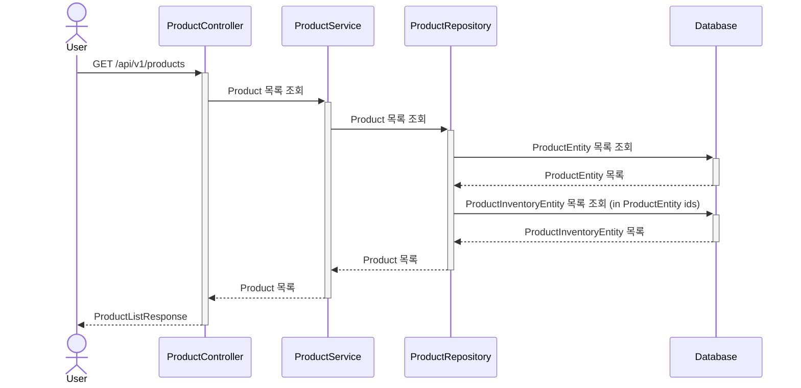
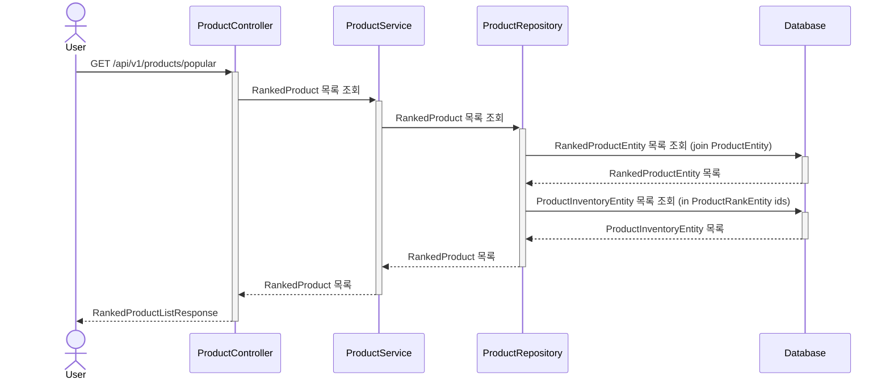
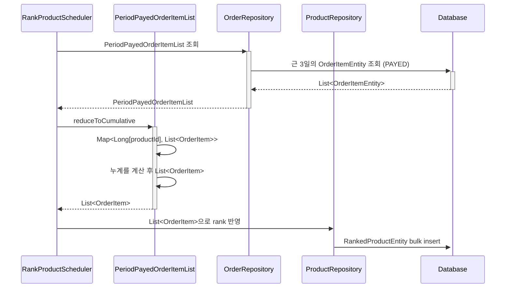

## 상품 조회 API

상품 재고(ProductInventoryEntity)는 이벤트 기반으로 저장하여 수정이 불가능하도록 합니다.
1일 단위로 스케쥴링을 통해 정리합니다.
이전 히스토리 추적을 위해 상품재고 히스토리 테이블도 관리합니다.
조회 후 애플리케이션에서 추산해 재고를 파악하는 데 쓰입니다.
이후 Product 도메인 엔티티 생성에 해당 결과값을 사용합니다.

## 인기 상품 조회 API

## 인기 상품 스케쥴링
