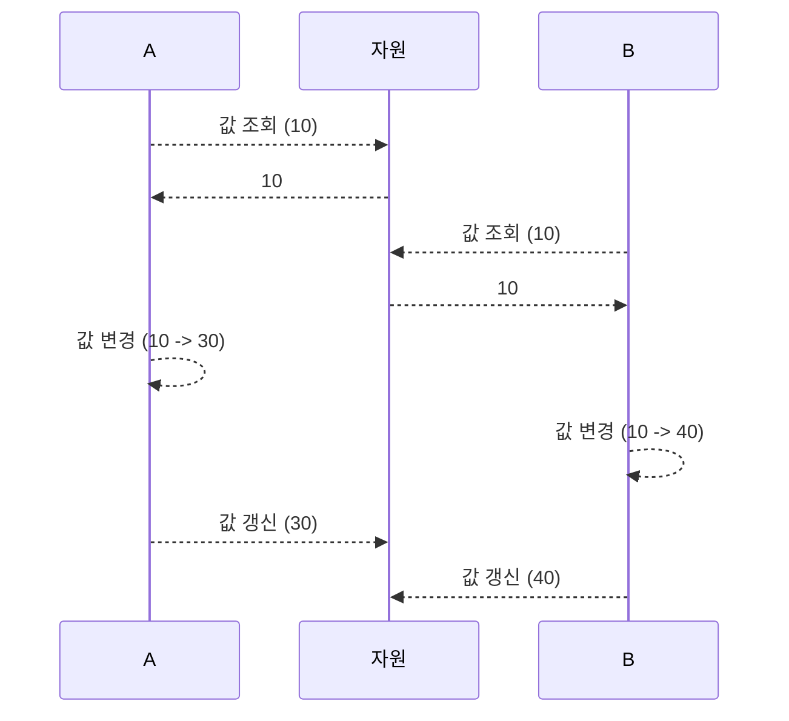

# 동시성 이슈

개념 설명은 하단으로 옮겼습니다.

## 상황에 따른 락 선택

이번 과제에 있는 요구사항 중 값을 변경시키는 작업은 다음과 같다.

1. 실시간 쿠폰 발급 (Coupon의 stock -1)
2. 상품 재고 차감 (Product의 stock -1)
3. 상품 재고 충전 (Product의 stock +1)
4. 포인트 충전 (UserPoint의 point + {입력값})
5. 포인트 차감 (UserPoint의 point - {입력값})
6. 발급받은 쿠폰 사용 처리 (PublishedCoupon의 usedAt = {현재시간})
7. 주문의 상태변경 (Order의 status = PAID)

### 낙관락

위에서 알 수 있듯이 낙관락은 예외를 발생시키는 특징이 있다.  
이를 이용해 재시도를 시도할 수 있지만, 동작들이 모두 데이터베이스가 아니라 애플리케이션에서 처리된다.  
따라서 재시도마다 데이터베이스를 조회하게 되고 재시도와 동시 접근 요청이 많아질수록 네트워크 부하가 발생한다.

이런 특징 때문에 동시 접근 수가 많아 재시도가 너무 많이 일어날 상황일 때,  
낙관락을 걸면 오히려 비관락보다 자원소모가 심할 수 있다.

1. 한 트랜잭션을 제외한 모든 트랜잭션에 예외를 발생시켜도 무관한 경우엔 많은 경우 낙관락을 사용한다.
   (해당 리소스에 대해 변경하는 값이 이분법적인 경우 (boolean처럼))

2. 이외에도 자기 자신만 접근할 수 있는 리소스의 경우에도 낙관락을 사용할 수 있다.

위와 같은 근거에 의해

UserPoint (자기자신만 접근 가능하고 한 트랜잭션의 결과만 수용)

1. 포인트 충전 (UserPoint의 point + {입력값})
2. 포인트 차감 (UserPoint의 point - {입력값})

PublishedCoupon (자기자신만 접근 가능하고 한 트랜잭션의 결과만 수용)

1. 발급받은 쿠폰 사용 처리 (PublishedCoupon의 usedAt = {현재시간})

Order (자기자신만 접근 가능하고 한 트랜잭션의 결과만 수용)

1. 주문의 상태변경 (Order의 status = PAID)

### 비관락

비관락의 경우 반대로 예외가 발생하지 않았으면 하는 리소스에서 사용한다.
락 점유를 못했다고 예외가 발생하면 사용자 입장에서 큰 기회비용 손실이기 때문이다.

Coupon (재고에 다수가 접근 가능하고 한 트랜잭션만 수용해서는 안됨)

1. 실시간 쿠폰 발급 (Coupon의 stock -1)
   **사용자 경험을 위해 timeout은 최대 10초까지 지정한다**

Product (재고에 다수가 접근 가능하고 한 트랜잭션만 수용해서는 안됨)

1. 상품 재고 차감 (Product의 stock -1)
2. 상품 재고 충전 (Product의 stock +1)

## 동시성이란?

동시성은 단일 공유자원에 대해 여러 스레드가 접근할 수 있는 가능성 때문에 발생한다.

갱신손실을 발생시키며 정확한 결과를 보장하지 못하게 한다.

### 갱신손실

갱신 손실은 같은 자원에 대해 동시에 접근한 스레드가 존재하고  
조회한 값을 토대로 변화시킨후 갱신을 시도한다고 했을 때,  
가장 나중에 갱신한 결과만 적용되고 나머지 작업의 갱신은 없어지는 현상이다.



위 처럼 기댓값은 20 + 30 -> 50이 더해진 60이지만, 실제 결과는 30만 더해진 40만 남아  
20이 더해진 작업에 대한 갱신이 손실된다는 현상이다.

## DB락

갱신손실현상을 방지하기 위해서 1, 2주차에 배운 ReentrantLock, synchronized 등이 있었지만,  
이번 주차의 과제는 서버가 여러대일 경우에도 원활하게 동작해야해서 DB락을 사용한다.

DB락에는 낙관락, 비관락과 분산환경에서도 파일기반으로 처리가 가능한 Named Lock이 있다.   
하지만 이번 주차에서는 낙관락과 비관락만 사용해 처리하고   
이후 주차에서 Named Lock, 레디스 spin Lock 등을 추가로 사용한다.

**하위 항목에서 언급하는 모든 조회는 수정을 목적으로 하는 조회입니다**

### 낙관락

낙관락은 비관적으로 데이터베이스에서 막지 않고,   
조회를 할 수 있게 열어두는 대신 논리적으로 갱신 쿼리를 막거나 재시도하는 전략이다.  
이를 처리하기 위해서 마지막 갱신 쿼리가 동작할 때 `update ... where version={조회당시 값}` 조건을 통해 검증한다.

JPA에서 지원하는 낙관락 기능을 사용하기 위해선 `@Version`을 해당하는 필드에 달아주어야하며  
정수라면 +1씩 자동으로 update 쿼리를 쓸 때 추가로 증가 시킨다.  
`update {테이블 명} set version = {조회당시 값+1} where version={조회당시 값}`  
이렇게 진행했을 때 만약 동시에 조회한 트랜잭션이 있다면 들고있는 리소스의 version은 모두 동일할 것이다.  
이후 가장 먼저 update쿼리를 치는 스레드만 where 절을 충족시킬 수 있다.
나머지 스레드는 updated rows가 0이 반환되고 @Version이 달려있어 `ConcurrencyFailureException`을 발생시킨다.
따라서 동시에 리소스에 접근하더라도 최종 갱신은 가장 처음 시도한 트랜잭션만 동작하기 때문에 갱신손실이 발생하지 않는다.

### 비관락

비관락은 낙관적 락과 다르게 데이터베이스에서 해당 row조회에 대한 다른 트랜잭션의 접근을 막는다.

```sql
select *
from coupons
where id = 1 for
update 
```

이렇게 SQL을 작성해 걸 수 있으며 락이 걸린 row (where 절을 충족하는 리소스)는     
다른 트랜잭션에서 조회를 시도할 때 대기를 하도록 만든다.  
락을 건 트랜잭션이 commit 된 후에야 다른 트랜잭션에서 조회를 할 수 있다.  
따라서 조회가 동시에 일어나지 않기 때문에 갱신손실을 막을 수 있다.  
하지만 대기시간동안 데이터베이스가 대기중인 쿼리 및 잠금정보 같은 정보를 알고 있어야하기 때문에 데이터베이스의 부하가 발생한다.

대기시간 timeout을 지정해 데드락을 방지할 수 있다.

JPA에서는 DataJpaRepository의 메소드에 `@Lock(PESSIMISTIC_WRITE_LOCK)`을 추가해 적용할 수 있다.  
해당 어노테이션 작성시 쿼리 뒤에 `for update`가 덧붙여져 비관락이 동작하게 된다.

