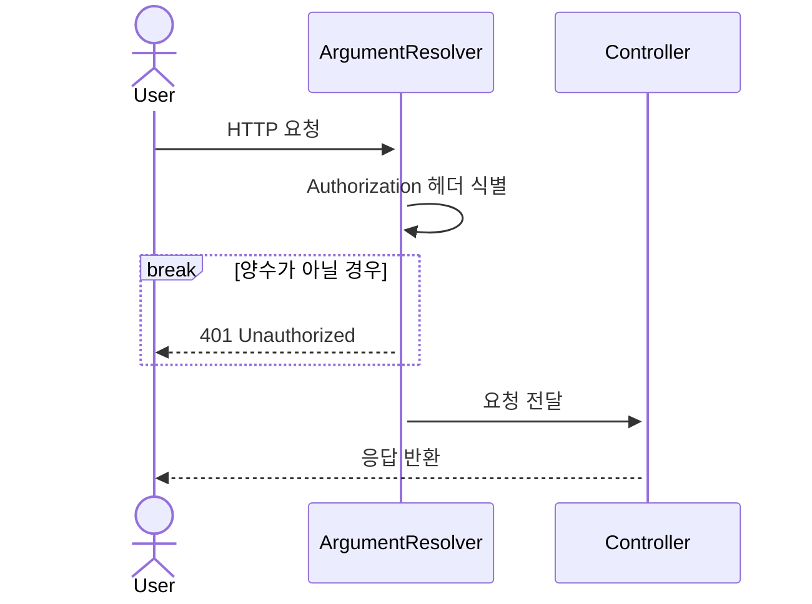

### 인증 대체

Authorization 헤더에 userId를 포함하여 전달하는 방식으로 구현합니다.

```mermaid
sequenceDiagram
    actor User
    participant ArgumentResolver
    participant Controller
    User ->>+ ArgumentResolver: HTTP 요청
    ArgumentResolver ->> ArgumentResolver: Authorization 헤더 식별
    break 양수가 아닐 경우
        ArgumentResolver -->> User: 401 Unauthorized
    end
    ArgumentResolver ->>+ Controller: 요청 전달
    Controller -->> User: 응답 반환
```