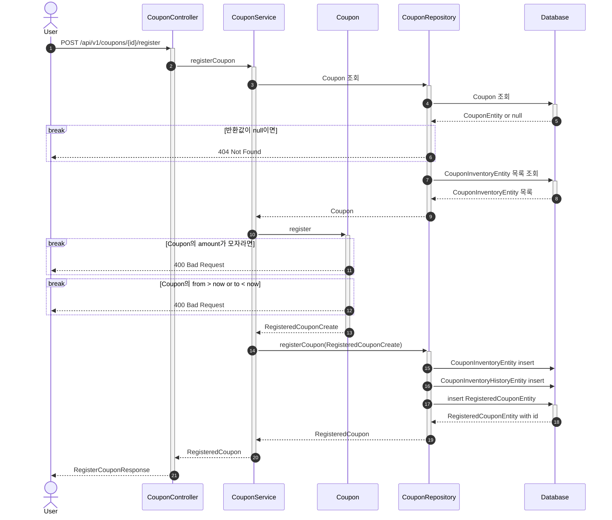
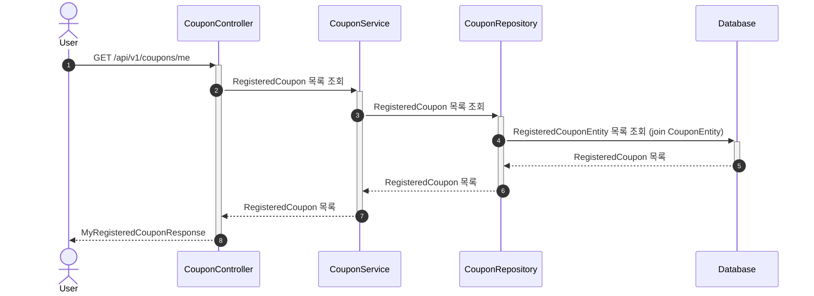

## 선착순 쿠폰 발급 API

쿠폰 재고는 이벤트 기반으로 저장하여 수정이 불가능하도록 합니다.
1일 단위로 스케쥴링을 통해 정리합니다.
이전 히스토리 추적을 위해 쿠폰재고 히스토리 테이블도 관리합니다.
조회 후 애플리케이션에서 추산해 재고를 파악하는 데 쓰입니다.
이후 Coupon 도메인 엔티티 생성에 해당 결과값을 사용합니다.

POST /api/v1/coupons/{id}/register
Authorization: {userId}
해당 쿠폰을 사용자에게 귀속합니다.

## 보유 쿠폰 조회 API

GET /api/v1/coupons/me
Authorization: {userId}

