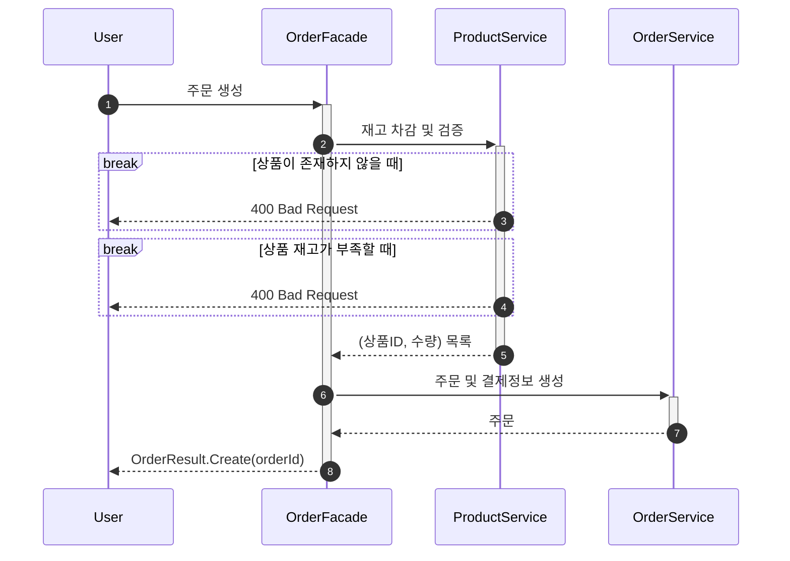
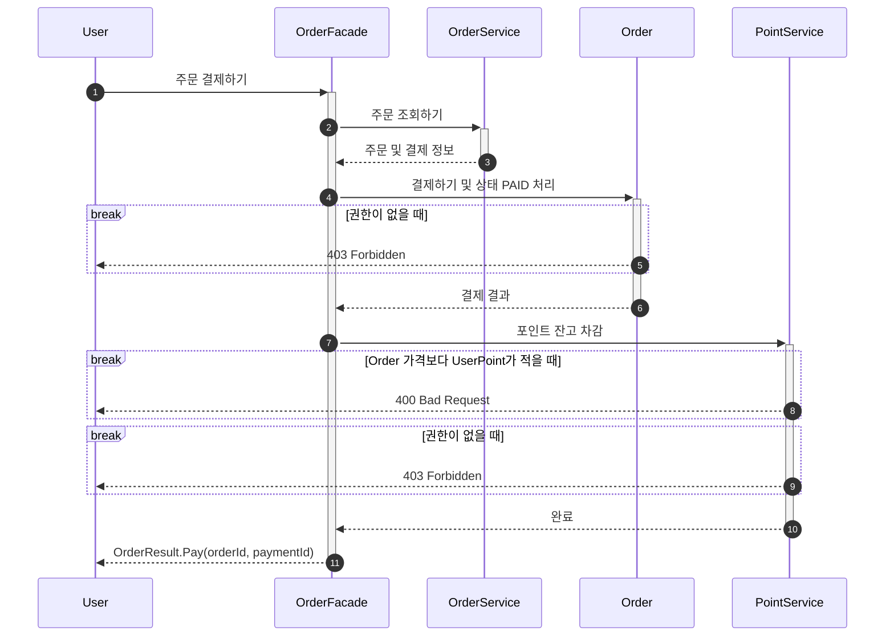
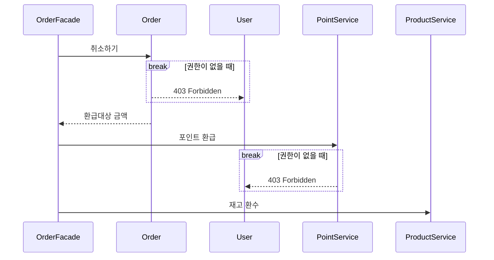
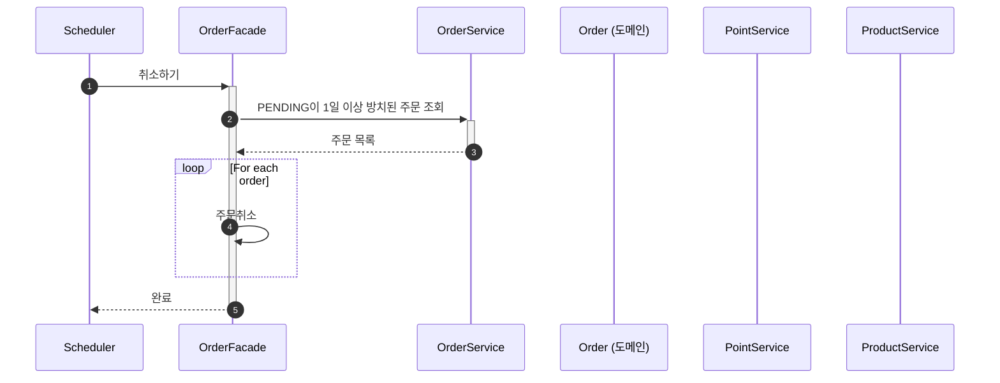

## 주문 및 결제 유저플로우

퍼시스턴스 레이어는 생략합니다.

1. 주문 생성은 인터파크 등 쇼핑몰에서 장바구니에서 주문하기를 눌렀을 때
   출력되는 주문 화면에 필요한 요소들로 정의합니다.
2. 쿠폰은 장바구니에서 지정하여 주문 화면에는 적용된 가격이 표시되는 것으로 정의합니다.
3. 결제하기는 주문 화면에서 결제수단을 선택 후 결제하기를 눌렀을 때 동작하는 것으로 정의합니다.
    4. 현재 요구사항에선 결제수단이 내부 포인트만 있는 것으로 정의합니다.

1. 주문 생성 API를 호출합니다.
    1. 주문 상품 id목록으로 상품 목록을 조회 후 검증합니다.
        1. 조회된 상품목록이 주문 상품 id목록을 모두 포함하는지
        2. 재고 수량이 주문량을 충족하는지
    3. 쿠폰 Id 목록으로 등록한 쿠폰 목록을 조회 후 검증합니다.
        4. 모두 포함하는지
    5. 상품목록은 OrderItemList로 변환합니다.
    6. OrderItemList에 등록한 쿠폰 목록을 전달하여 할인가를 포함한 Order를 생성합니다.
    7. 반환합니다.
8. 결제 API를 호출합니다.
    9. order id로 가져오고 유효한 주문(PENDING_PAYMENT)인지 확인합니다.
    10. userid로 포인트를 조회합니다.
    11. PaymentService에 주문과 포인트를 전달해 결제를 수행합니다.
        12. 주문의 결제함수에 포인트를 전달합니다.
        13. 포인트의 사용함수를 동작시킵니다.
            14. 잔액이 충분한지 검증후 차감합니다.
        15. 주문결과를 반환합니다.
    16. 주문 결과를 기반으로 외부 데이터 플랫폼에 전달합니다.
    17. 결제 결과를 반환합니다.

# 주문 생성

# 주문 결제하기

# 주문 취소

# 주문 취소 스케쥴링

