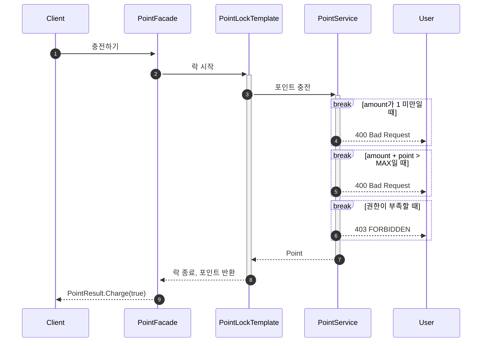

## 잔액 충전 API

POST /api/v1/points/charge
Authorization: {userId}
잔액을 충전합니다.

```mermaid
sequenceDiagram
    autonumber
    participant Client
    participant PointFacade
    participant PointLockTemplate
    participant PointService
    Client ->>+ PointFacade: 충전하기
    PointFacade ->>+ PointLockTemplate: 락 시작
    PointLockTemplate ->>+ PointService: 포인트 충전
    break amount가 1 미만일 때
        PointService -->> User: 400 Bad Request
    end
    break amount + point > MAX일 때
        PointService -->> User: 400 Bad Request
    end
    break 권한이 부족할 때
        PointService -->> User: 403 FORBIDDEN
    end
    PointService -->>- PointLockTemplate: Point
    PointLockTemplate -->>- PointFacade: 락 종료, 포인트 반환
    PointFacade -->> Client: PointResult.Charge(true)
```