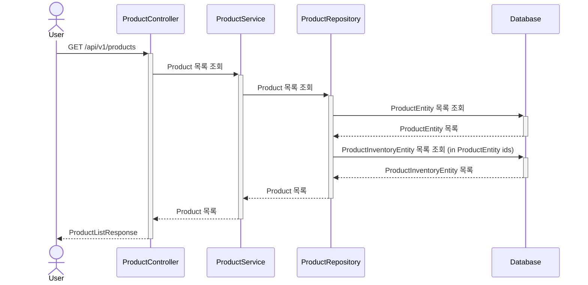
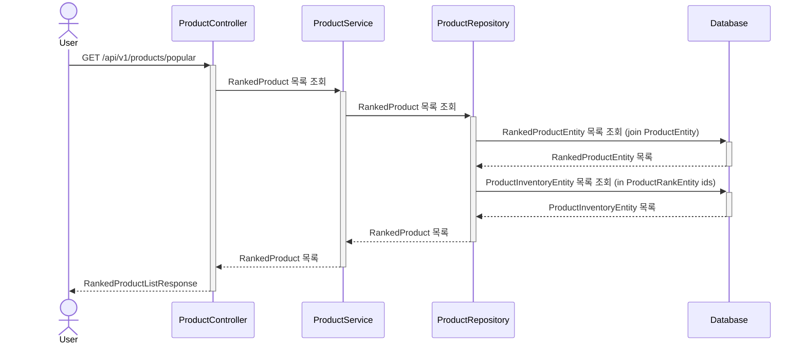
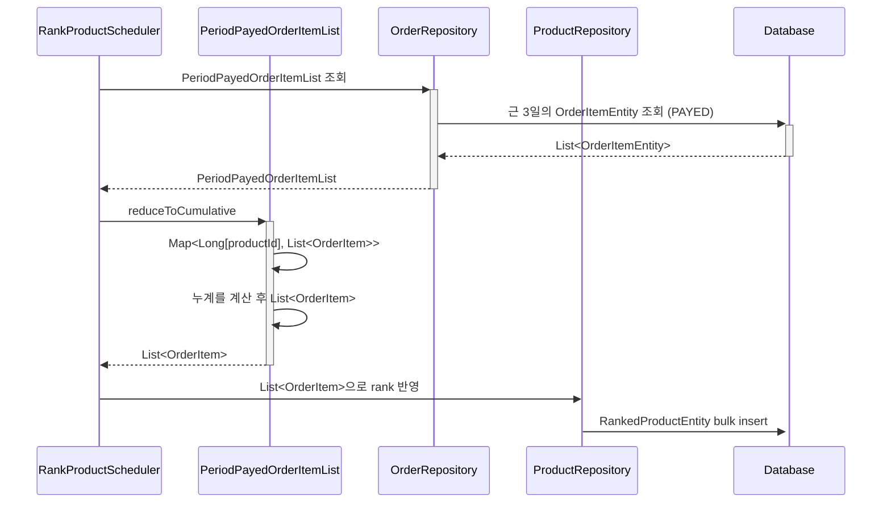
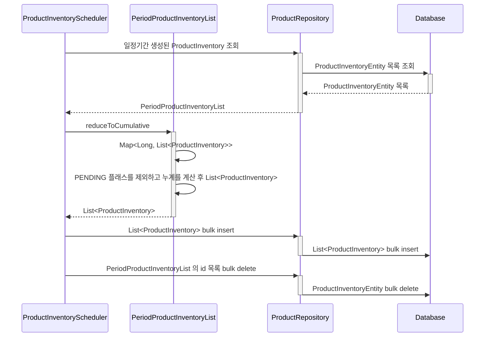

## 상품 조회 API

상품 재고(ProductInventoryEntity)는 이벤트 기반으로 저장하여 수정이 불가능하도록 합니다.
1일 단위로 스케쥴링을 통해 정리합니다.
이전 히스토리 추적을 위해 상품재고 히스토리 테이블도 관리합니다.
조회 후 애플리케이션에서 추산해 재고를 파악하는 데 쓰입니다.
이후 Product 도메인 엔티티 생성에 해당 결과값을 사용합니다.

주문 생성 시 ProductInventoryEntity에 PENDING 플래그로 -amount 만큼 insert되고
주문 이외에 재고 추가시 STOCK 플래그로 insert 됩니다.

주문 생성 후 일정시간 뒤 재고 반환의 경우 ProductInventiryEntity에 CANCELED 플래그로 +amount insert됩니다.
결제가 진행될 경우 STOCK 플래그로 +amount insert 후 RELEASE 플래그로 -amount insert 됩니다.
1일간 주문이 결제되지 않으면 배치로 스냅샷을 할 때 PENDING 플래그는 제외하고 처리합니다. 

GET /api/v1/products
상품 목록을 조회합니다.

## 인기 상품 조회 API
GET /api/v1/products/popular
최근 3일간 가장 많이 팔린 상품목록을 조회합니다.

## 인기 상품 스케쥴링

## 상품 재고 스케쥴링
상품 재고를 스케쥴링합니다.
일정기간 이후에 생성된 이벤트만 대상으로 지정합니다.
