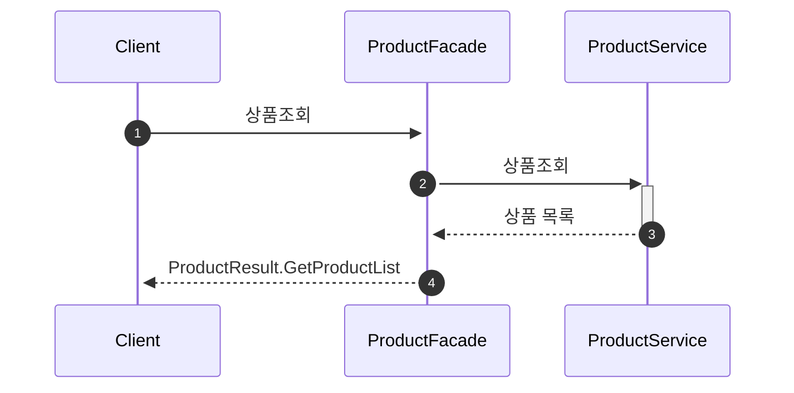
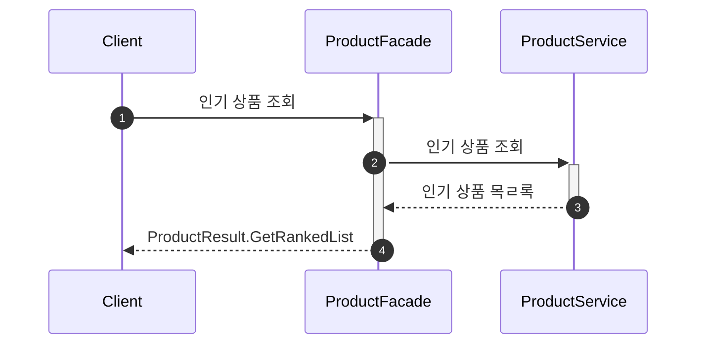
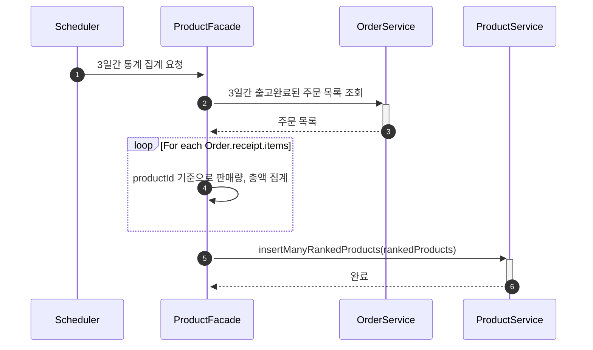

## 상품 목록 조회

상품 목록을 조회합니다.

```mermaid
sequenceDiagram
    autonumber
    participant Client
    participant ProductFacade
    participant ProductService
    Client ->>+ ProductFacade: 상품조회
    ProductFacade ->>+ ProductService: 상품조회
    ProductService -->>- ProductFacade: 상품 목록
    ProductFacade -->>+ Client: ProductResult.GetProductList
```

## 인기 상품 조회 API

GET /api/v1/products/popular
최근 3일간 가장 많이 팔린 상품목록을 조회합니다.

```mermaid
sequenceDiagram
    autonumber
    participant Client
    participant ProductFacade
    participant ProductService
    Client ->>+ ProductFacade: 인기 상품 조회
    ProductFacade ->>+ ProductService: 인기 상품 조회
    ProductService -->>- ProductFacade: 인기 상품 목ㄹ록
    ProductFacade -->>- Client: ProductResult.GetRankedList
```

## 인기 상품 스케쥴링

```mermaid
sequenceDiagram
    autonumber
    participant Scheduler
    participant ProductFacade
    participant OrderService
    participant ProductService
    Scheduler ->>+ ProductFacade: 3일간 통계 집계 요청
    ProductFacade ->>+ OrderService: 3일간 출고완료된 주문 목록 조회
    OrderService -->>- ProductFacade: 주문 목록
    loop For each Order.receipt.items
        ProductFacade ->> ProductFacade: productId 기준으로 판매량, 총액 집계
    end
    ProductFacade ->>+ ProductService: insertManyRankedProducts(rankedProducts)
    ProductService -->>- ProductFacade: 완료
```