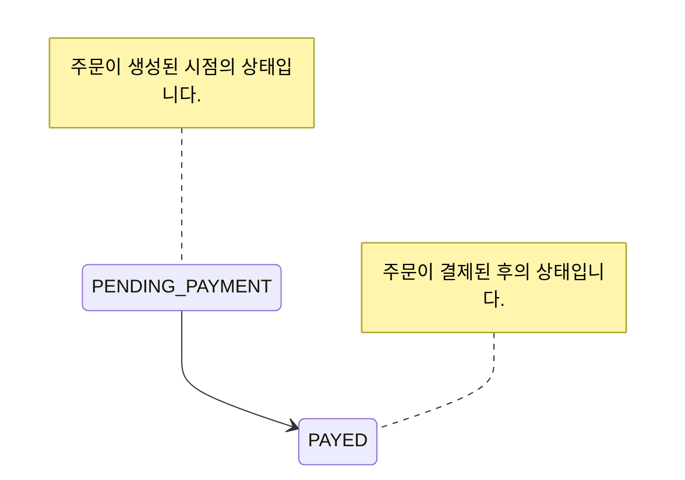

## State
도메인의 상태의 전이과정을 나타냅니다.

### PaymentState 
주문의 결제상황을 나타냅니다.

```mermaid
stateDiagram-v2
    PENDING_PAYMENT --> PAYED
    note left of PENDING_PAYMENT  
        주문이 생성된 시점의 상태입니다.
    end note
    note left of PAYED  
        주문이 결제된 후의 상태입니다.
    end note
```